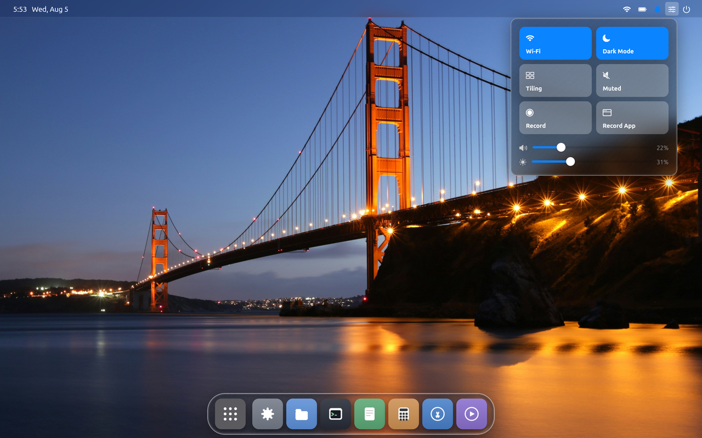
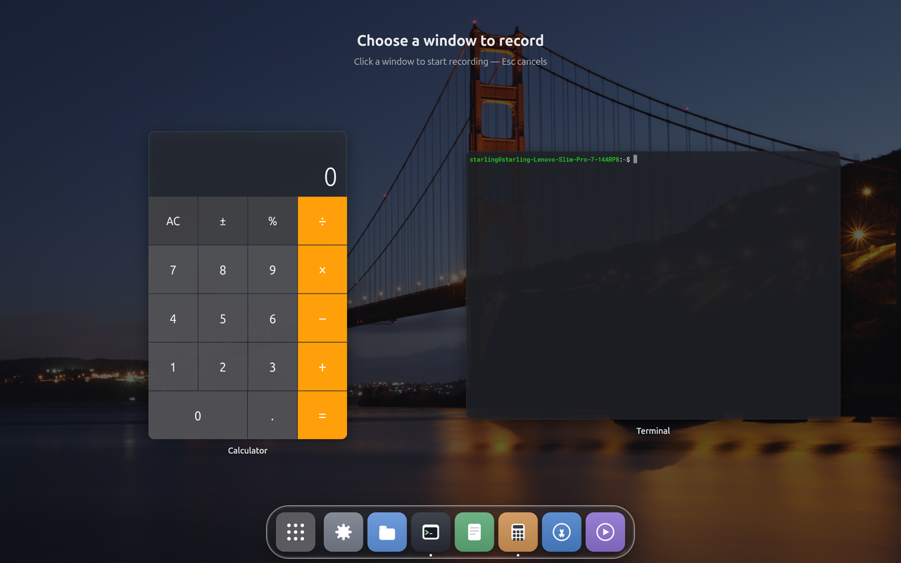
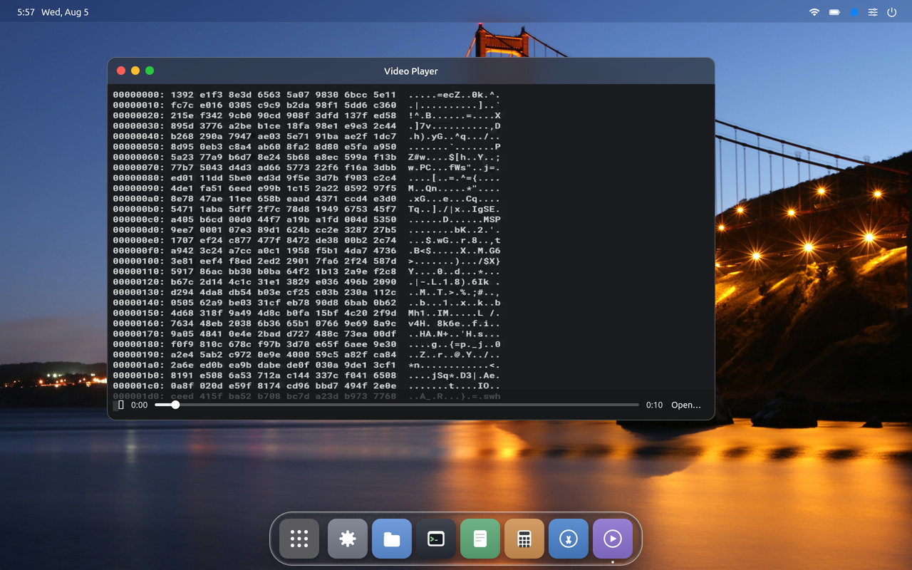
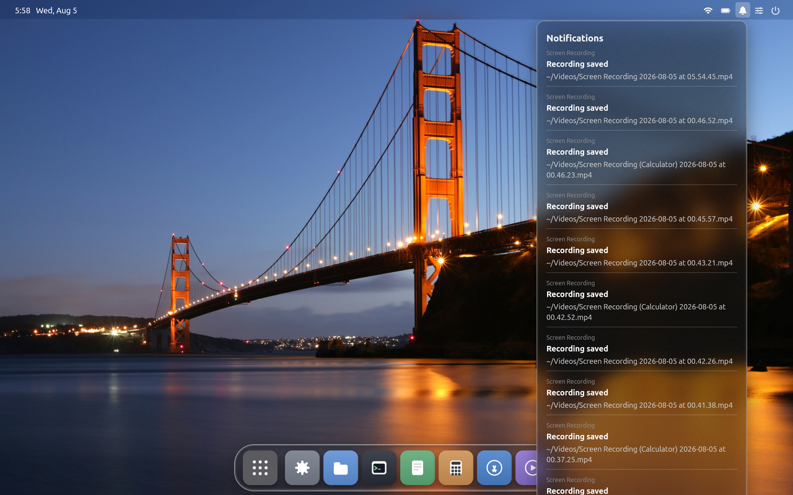
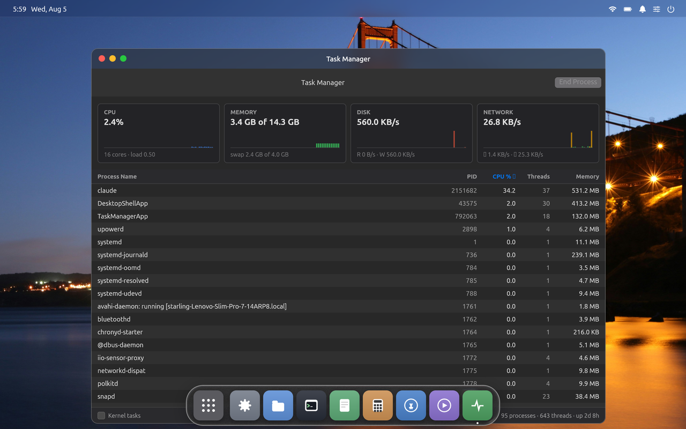

# Starling 0.2.3 — screen recording, a control center, and a terminal that keeps up

135 commits since 0.2.2. The headline is that the desktop can now record itself
— the whole screen or one window — and play the result back without leaving
Starling. Underneath, the terminal got roughly four times faster and the shell
stopped leaking file descriptors on long sessions.

## Screen recording

A control center arrives with this release: Wi-Fi, Dark Mode, Tiling, mute,
volume and brightness, and the two new recording tiles. **Record** captures the
whole screen to an MP4 in `~/Videos`. A red dot and a running clock sit in the
status bar the entire time, so a recording can never be running unnoticed.

Recording is hardware-encoded and zero-copy where the machine allows it: the
compositor hands the frame it already composited straight to the GPU's H.264
encoder as a dma-buf, so the CPU never touches a pixel. On this laptop that
costs about 0.05 of a core. Machines without a VA-API encoder fall back to a
software x264 pipe, which still works — it just costs more.

Two capture bugs are fixed along the way. A 37-second capture used to weigh
265 MB, because the frame-rate cap was nominal (the encoder was fed one frame
per *present*, so a 90 Hz panel recorded at 90 fps) and the quantiser was fixed
with no ceiling on bitrate. Capped VBR and a real rate cap take the same
recording to about 19 Mbps. Separately, frames were paced relative to the last
captured frame, so any present missed to a busy client was lost for good and
recordings settled at ~27.6 of the 30 fps requested; pacing against an absolute
schedule holds a flat 30.0.

## Record App — one window, not a patch of screen

**Record App** opens Mission Control and asks which window you want. What it
captures is the window's own content, not the screen region it occupies — so
windows stacked on top of it never appear, and moving or resizing the window
mid-recording doesn't spoil the take. New in this release: the pointer is drawn
into app recordings and tracks the window as it moves, which is what makes a
demo recording worth anything.

## A video player that plays them back

The video player returns, with a QuickTime-style scrubber you can click or drag
to seek. For Starling's own recordings it decodes entirely on the GPU — its own
MP4 demuxer and H.264 parser feed VA-API directly, and the decoded surface goes
to the compositor as a dma-buf, so no frame is ever copied through the CPU. It
plays other formats through a spawned ffmpeg.

Playback used to flicker badly: the whole window, control bar included, went
black on 40% of presented frames, and a 2560×1600 file burned a core doing it.
Both are fixed — decode is capped at the window's pixel size and the upload
moved out of the paint path.

## Notifications, and a portal that Chrome can talk to

Notifications collect behind a bell in the status bar rather than interrupting
as banners. Nothing steals focus; the bell shows what happened when you want it.

The xdg-desktop-portal implementation gained a **ScreenCast** backend, so the
desktop can stream itself over PipeWire — this is the interface behind
`getDisplayMedia` in Chromium and screen sharing in OBS. Two protocol bugs that
broke file dialogs in Chromium and Electron apps are fixed too: `Response`
signals are now directed at the caller, and request paths use the spec's own
dialect for the sender name.

## Task Manager

A Task Manager joins the desktop — CPU, memory, disk and network with live
sparklines, a sortable process table, and End Process. It follows the desktop's
appearance rather than the example-era light theme it was born with.

## The terminal is about four times faster

A bulk dump into the terminal cost roughly 4× what it should, and the reasons
were all in how cells were stored and parsed. Five changes land together: the
cell no longer holds a Swift `Character` (a heap-allocating grapheme cluster) for
what is almost always one byte; escape-sequence handling stopped re-scanning
what it had already parsed; Swift runtime checks that dominated the profile were
removed from the hot path; blank rows are shared copy-on-write when scrolling;
and background-colour erase now reaches the right edge instead of stopping a
column short.

Measured on a full-screen hex dump, the terminal moves about 48 MB/s where it
previously managed 13.9. There is a benchmark in `test/bench/` now, because one
sequence dump gave a misleading answer during this work.

## Fixes worth calling out

- **Long sessions ran out of file descriptors.** After about 45 minutes with a
  dma-buf client, the shell held 939 stranded fds against a 1024 limit, and the
  Wayland accept loop spun on `EMFILE` — no new application could start. The
  soft limit is raised to the hard limit at startup and the retired-fd list is
  bounded at the point it grows.
- **HiDPI scale is taken from the panel** rather than assumed to be 4K, and a
  window straddling two displays comes home properly on hotplug instead of
  being left mostly off-screen.
- **A double close of the child socket killed the shell**; there is now one
  owner.
- **Child apps unpin from 10 fps** — they wake on the GCD file descriptor and
  build on one thread.
- **Fullscreen hides the dock**, revealed by pushing at the bottom edge, and
  fullscreen content gets the window material back on HiDPI.
- **Settings reports "dev build"** for a staged run instead of quoting the
  installed package's version.

## Under the hood

The Flutter→Swift framework (`sdk/`) is a folder in this repository again
rather than a sibling repo, so a change that spans the framework and the shell
is one commit and one build. The tree also builds and packages without
`swiftly` and without `gclient`.

## Verification

The release gate runs the packaged `.deb` on a clean VM: install, a real GDM
login, seat-activeness, the polkit authorisation behind the App Store's
Install button, the functional checks **both on a GPU and with 3D acceleration
switched off**, and finally shutting the machine down through the desktop's own
power menu. All of it passes for this build.

Two gate bugs were found and fixed in the process, both of which had made the
harness lie: a check that watched for a process living microseconds at a time
and concluded the recorder was frozen, and a VM launcher that rendered the
guest's 3D on whichever GPU enumerated first — the unused card, on a laptop
with switchable graphics.
